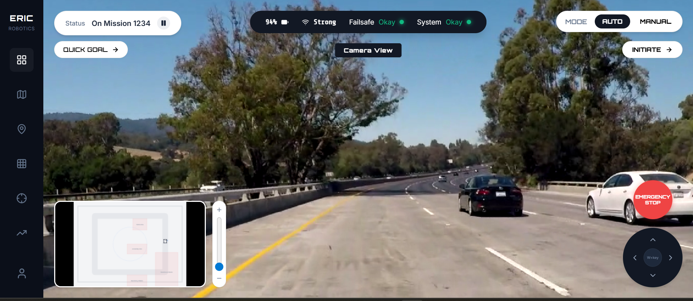
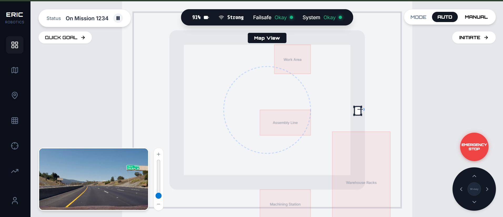
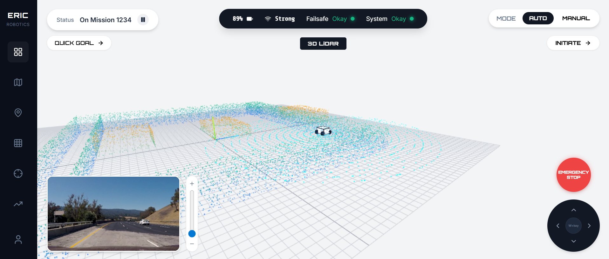

# Insight.IO Robotics Dashboard

## Candidate Details
- **Full Name:** Vishal Kale
- **Contact Number:** +91 7666379887
- **Email ID:** vishalkale1225@gmail.com

---

A high-fidelity, modern dashboard built for remote robotics operators. Designed to provide real-time situational awareness through multi-modal sensor fusion, telemetry tracking, and an intuitive user interface.

## Features

- **Dynamic Viewport Swapping**: Seamlessly transition between the 2D Map, 3D LiDAR, and FPV Camera feed using the left sidebar navigation.
- **Procedural 3D LiDAR Point Cloud**: Built with Three.js, simulating a realistic warehouse environment (static walls, obstacles) with active rotating Velodyne-style laser rings tracking the robot.
- **Synchronized FPV Video Feed**: Real-time video simulation that directly ties into the robot's mission state (pauses when the robot halts).
- **2D Occupancy Grid Map**: A top-down blueprint tracking the robot's coordinates and orientation with high precision.
- **Advanced Auto-Mode Kinematics**: Simulates the robot autonomously navigating through a warehouse corridor layout (straight segments and corner arcs) rather than basic circular motion.
- **Picture-in-Picture (PiP)**: A floating HUD allows you to maintain situational awareness of the map while viewing the full-screen camera or LiDAR.
- **Real-time Telemetry**: Live metrics including linear/angular velocity, battery life, connection signal strength, and system health status.
- **Manual Overrides**: D-Pad interface and keyboard mapping (W/A/S/D) for manual remote teleoperation.

## Tech Stack

- **Framework**: React 19 + Vite
- **3D Rendering**: Three.js (via raw WebGL wrappers for maximum performance)
- **Styling**: Vanilla CSS Modules (Responsive, Glassmorphism, Dark Mode Aesthetics)
- **Icons**: Lucide React

## Getting Started

### Prerequisites
Make sure you have [Node.js](https://nodejs.org/) installed on your machine.

### Installation

1. Clone the repository and navigate to the project folder:
   ```bash
   cd insight-io-dashboard
   ```

2. Install dependencies:
   ```bash
   npm install
   ```

3. Start the development server:
   ```bash
   npm run dev
   ```

4. Open your browser and navigate to `http://localhost:5173`.

## Architecture & Design Decisions

- **State Management**: Centralized React state manages the core `telemetry` (x, y, yaw, velocity) to ensure the 2D canvas, the Three.js 3D scene, and the UI all render in perfect synchronization at 60fps.
- **Three.js Optimization**: The LiDAR point cloud utilizes highly optimized `Float32Arrays` with `BufferGeometry` and `PointsMaterial`, allowing it to handle tens of thousands of procedural points with zero performance drops.
- **UI/UX**: Prioritized a dark, glassmorphic aesthetic to reduce eye strain for operators, mimicking mission-control grade software. 




